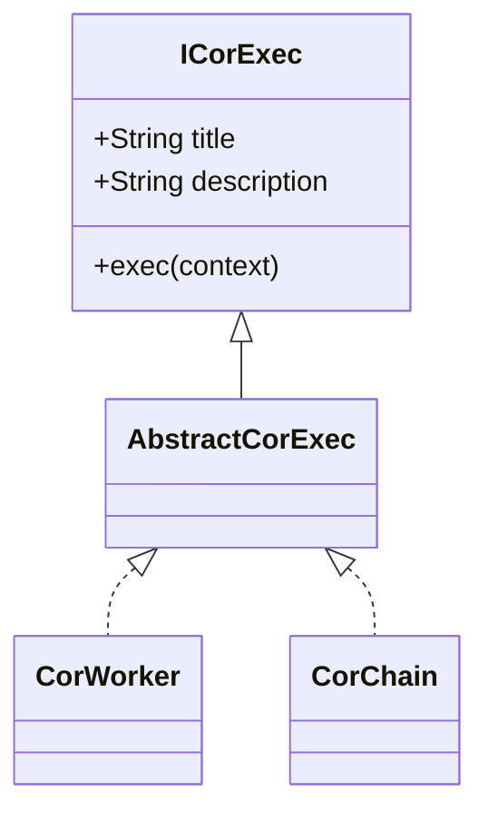

# hello-world
Repository for "Hello World" Guide

This account was created for "Java Web" course.

This line was created on github.

Another line created on github.

```mermaid
classDiagram
    class ICorExec {
        +String title
        +String description
        +exec(context)
    }
    
    class AbstractCorExec
    %% Одинарный обработчик
    class CorWorker
    %% Цепочка обработчиков, в т.ч. и вложенных chain
    class CorChain
    
    ICorExec <|-- AbstractCorExec
    AbstractCorExec <|.. CorWorker
    AbstractCorExec <|.. CorChain
```
